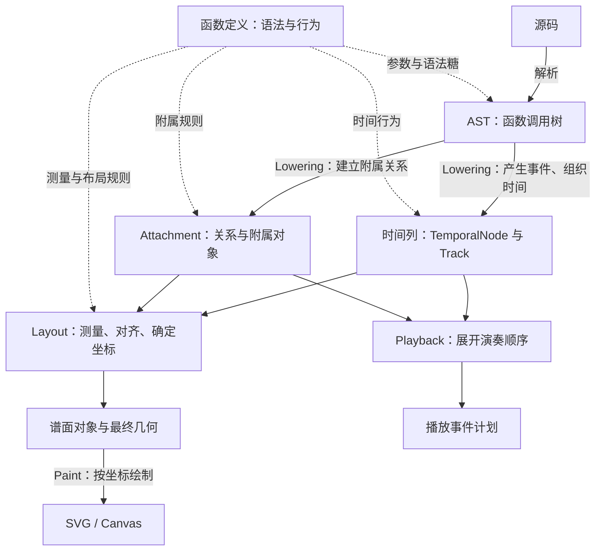

jpFun 将源码逐步转换为三种表示：**函数调用树、时间列、带坐标的谱面对象**。这三种表示分别组织语法、音乐时间和页面空间。函数定义每种记号的规则，引擎负责将这些规则组合成完整乐谱。

## 整体结构

图中实线表示数据转换，虚线表示函数向各阶段提供的规则。

### AST：建立函数调用树

解析器把源码中的记号转换为函数调用，并根据内容的嵌套关系建立 AST。显式调用和语法糖都归入同一套函数模型，例如 `1/` 表达减时函数作用于音符，树中由减时节点包含音符节点。

函数类定义一种记号的名称、参数、语法糖和处理行为；AST 节点则表示源码中一次具体的调用，保存这次调用的参数、子节点和源码位置。树的结构表达“谁包含谁、谁修饰谁”。

### Lowering：将元素组织成时间列

Lowering 遍历调用树，执行各节点的时间行为。音符等节点产生时间事件 `TemporalNode`（基类为 `TemporalNodeBase`）；范围函数修饰内部事件，声部函数组织顺序或并行关系。

事件在这一阶段获得开始时间、持续时间和所属轨道 `Track`，再按时间与对齐规则归并成一列一列。每列提供一个横向对齐基准，Track 表达纵向基线及其层级关系。多声部中同时发生的音符由此可以在谱面上对齐。

连音线等关系通过 attachment 保留下来，与时间列一起交给后续阶段。至此，树中的嵌套语义已转换为事件的时间位置、轨道归属和对象间的关系。

### Layout：确定坐标

Layout 测量可见对象的尺寸，根据时间列求横向位置，根据 Track 和对象占用求纵向位置，再放入页面。音乐时值影响间距，实际坐标同时受符号尺寸、对齐和页面空间约束。

主体坐标确定后，附属对象据此生成连线、包围框等几何。输出包含各对象的位置、尺寸和分页结果，绘制阶段按这些结果输出 SVG 或 Canvas。

播放从 Lowering 的时间模型分出另一条路径，展开反复和演奏行为，生成供音频后端调度的事件计划。谱面布局与播放因此可以各自处理空间和演奏时间。

## 函数如何贯穿各阶段

一个函数的实现可以涵盖语法、时间、布局和绘制。相关行为由不同阶段调用，运行数据保存在相应对象中：

| 对象 | 生成时机 | 后续作用 |
| --- | --- | --- |
| 函数 AST 节点 | 解析具体调用时 | 在 Lowering 中产生事件、修饰内容或建立关系 |
| TemporalNode | AST 节点在 Lowering 中产生 | 保存时间语义；可见事件参与布局与绘制，发声或控制事件参与播放 |
| Attachment | Lowering 建立关系或汇总事件时 | 按自身能力参与布局、绘制或播放控制 |
| 局部装饰 | Layout 根据主体携带的装饰信息创建 | 扩展主体的尺寸、连接位置或绘制内容 |

以 `1/` 为例：解析建立“减时函数包含音符函数”的树；Lowering 中音符节点产生 TemporalNode，减时函数将其时长减半，并记录减时线信息；Layout 为音符及减时线准备几何、确定位置；Paint 绘制数字和减时线。播放使用同一事件的减半时值。

函数按需要参与各阶段：音符产生主体事件，减时函数修饰内部事件，连音线函数建立附属关系。AST 在解析后保持只读；每次 Lowering 创建本轮事件与附属对象，供后续布局和播放使用。

## 函数提供规则，引擎组织整体

函数负责一种记号的局部语义：参数如何解释、时长怎样变化、图形需要多大空间、如何绘制。引擎负责乐谱整体的组织：遍历调用树、归并时间列、求解坐标和调度绘制。

这种分工让每种记号的规则集中在自己的实现中，同时共享多声部对齐、分页和渲染等通用能力。新增记号时，先确定它产生或修饰哪些对象，再接入对应阶段。

具体协议与算法见[源码解析](../parser/)、[Lowering](../lowering/)、[布局](../layout/)、[渲染](../render/)和[播放](../playback/)。公共 API 的用法见[在项目中使用](../use/)。