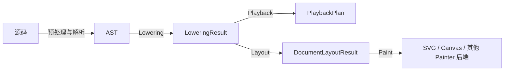

jpFun 将简谱 DSL 源码转换为时间事件，再生成页面布局或播放计划。本文先介绍这些阶段如何衔接，再说明新增功能时应该从哪里入手。

## 流水线

引擎负责组织流程，具体符号通过函数类提供语法、时间、布局和绘制规则。比如，连音线怎样画由 tie 决定，引擎只负责在合适的阶段调用它。



公共入口 [`compileScore`](https://github.com/madderscientist/jpFun/blob/HEAD/packages/jpfun/src/pipeline.ts) 串起解析、Lowering 和布局，并保留中间结果。播放和渲染分别调用各自的入口；同一份布局可以交给多个渲染后端。

| 阶段 | 输入与输出 | 主要工作 | 留给其他阶段的工作 | 代码与详解 |
| --- | --- | --- | --- | --- |
| 解析 | 源码 -> AST | 基础语法、参数固化、语法糖调度、源码位置 | 时间、坐标、绘制 | [`src/parser/`](https://github.com/madderscientist/jpFun/tree/HEAD/packages/jpfun/src/parser/) · [解析](../parser/) |
| Lowering | AST -> `LoweringResult` | 时间顺序、并行音轨、事件列、关系对象 | 像素坐标、绘制 | [`src/lowering/`](https://github.com/madderscientist/jpFun/tree/HEAD/packages/jpfun/src/lowering/) · [Lowering](../lowering/) |
| Playback | `LoweringResult` -> `PlaybackPlan` | 演奏手势、速度、延续关系、乐谱/演奏时间映射 | 音频设备、实时调度、像素坐标 | [`src/playback/`](https://github.com/madderscientist/jpFun/tree/HEAD/packages/jpfun/src/playback/) · [播放](../playback/) |
| Layout | `LoweringResult` -> `DocumentLayoutResult` | 测量、横纵向求解、分页、最终几何 | 语法解析、业务语义、后端 API | [`src/layout/`](https://github.com/madderscientist/jpFun/tree/HEAD/packages/jpfun/src/layout/) · [布局](../layout/) |
| Paint | 布局结果 -> 绘制命令 | 按层调用 `Painter` | 重新测量或改变布局 | [`src/render/`](https://github.com/madderscientist/jpFun/tree/HEAD/packages/jpfun/src/render/) · [渲染](../render/) |

编辑器的高亮、补全等功能另用 `analyzeScoreSyntax`。这条路径只扫描语法，不构建 AST，详见[编辑器集成](../editor/)。

各阶段通过表中的数据结构传递结果。如果一个功能需要读取后续阶段才产生的数据，可以先检查它是否应该放到那个阶段实现。

## 模块分工

### 外部格式转换

[`src/converter/`](https://github.com/madderscientist/jpFun/tree/HEAD/packages/jpfun/src/converter/) 先读取 MIDI 或 MusicXML 的时间模型，再生成 jpFun 源码。两种格式的实现分别在 [`midi/`](https://github.com/madderscientist/jpFun/tree/HEAD/packages/jpfun/src/converter/midi/) 和 [`musicxml/`](https://github.com/madderscientist/jpFun/tree/HEAD/packages/jpfun/src/converter/musicxml/) 中：MIDI 使用整数网格，MusicXML 使用精确的 `Fraction` 时值。

两者共用根目录的 `source.ts` 来生成 DSL token、谱头和谱面系统。这个模块只处理输出语法，不读取输入格式。

MusicXML 转换进一步分为 DOM 读取（`musicxml/dom.ts`）、单个元素的解释（`musicxml/features.ts`）、解析结果类型（`musicxml/model.ts`），以及时间线组织和源码生成（`musicxml/index.ts`）。新增元素支持通常从 features 入手；涉及跨事件状态或配对时，再修改 index；输出语法变化则优先修改共享的 source 模块。

浏览器 classic script 提供全量 `jpfun.min.js`，也提供 core、from-midi、from-musicxml 三个按需加载的产物。MusicXML 导入不依赖编译流水线；MIDI 的量化、分轨、三连音和固定断行也可以独立运行，只有按实际几何自动断行时才需要调用 core 布局。

### 引擎调度，函数声明

内置符号都位于 [`src/functions/`](https://github.com/madderscientist/jpFun/tree/HEAD/packages/jpfun/src/functions/)。一个函数类可以按需声明：

- 如何被解析，以及有哪些参数和语法糖；
- 如何产生时间事件、修饰作用域或建立并行关系；
- 如何测量自身、参与布局或附着到其他对象；
- 如何通过 `Painter` 发出绘制命令。

Parser、Lowering 和 Layout 通过这些接口调用函数，不需要按函数名判断行为。新增符号通常只需添加函数目录，并在 [`defaultFunctions`](https://github.com/madderscientist/jpFun/blob/HEAD/packages/jpfun/src/functions/default.ts) 中注册。

### AST 只描述源码

AST 保存语法结构、已固化参数和源码位置。解析完成后，AST 保持只读；每次编译产生的时间、轨道和布局状态都写入新的中间对象。这样同一棵 AST 可以再次 Lowering，也不会携带上一次布局的临时状态。

多次 Lowering 得到的时间、轨道和布局对象彼此独立，可以先生成 A、B，再按任意顺序布局。如果多个 hook 需要共享本轮状态，把它放在 `LoweringGroup` 或本轮已有的 Temporal 上即可。

例如，`head` 用首个左边界 Temporal 保存本轮成员、六个边界和轨道测量状态；AST 只保存槽内容、字号和间距。这样就不会误取到上一次编译产生的事件。

### 时间、几何、绘制彼此分离

- Lowering 使用音乐时间和 Track，不计算像素。
- Playback 根据已确定的时间事件展开演奏行为，不读取布局几何。
- Layout 根据事件及其关系计算 `LayoutBox` 和页面坐标。
- Paint 只读取最终几何，不测量、不回写布局。

这使编辑器可以读取 AST，播放器可以读取 `LoweringResult`，而 SVG 与 Canvas 可以共享同一份布局。

### 选择对象类型

| 类型 | 何时使用 | 例子 |
| --- | --- | --- |
| `TemporalNodeBase` | 对象占据时间流，需要进入事件列 | 音符、小节线、控制事件 |
| `LayoutDecoration` | 对象只修饰单个主体，与主体共享位置 | 附点、减时线 |
| `LoweringAttachment` | 对象不推进时间，按需参与布局或播放 | tie、volta、声部大括号、页码 |
| `LayoutAttachment` | 附属对象需要参与排版 | 连音线、连梁、歌词、box |

先判断功能属于哪种对象，再选择要实现的 hook。这样，大多数符号规则都能留在自己的函数目录中。

## 主要接口

| 契约 | 作用 | 定义位置 |
| --- | --- | --- |
| `ASTFunctionClass` / `ASTFunctionNode` | 注册器读取的静态声明 / 函数 AST 实例及参数行为 | [`ASTtypes.ts`](https://github.com/madderscientist/jpFun/blob/HEAD/packages/jpfun/src/functions/ASTtypes.ts) |
| `LoweringResult` | 时间列、attachments、Track 树及 AST 到事件的索引 | [`lowering/types.ts`](https://github.com/madderscientist/jpFun/blob/HEAD/packages/jpfun/src/lowering/types.ts) |
| `LoweringAttachment` | 不推进时间的中立附属协议 | [`lowering/types.ts`](https://github.com/madderscientist/jpFun/blob/HEAD/packages/jpfun/src/lowering/types.ts) |
| `TemporalNodeBase` | 一次编译中的时间事件及其可选视觉主体 | [`functions/temporal.ts`](https://github.com/madderscientist/jpFun/blob/HEAD/packages/jpfun/src/functions/temporal.ts) |
| `PlaybackPlan` / `PlaybackEmitter` | MIDI 事件计划 / 函数事件声明接口 | [`playback/types.ts`](https://github.com/madderscientist/jpFun/blob/HEAD/packages/jpfun/src/playback/types.ts) |
| `LayoutBox` | 主体的尺寸、位置和对齐轴 | [`layout/types.ts`](https://github.com/madderscientist/jpFun/blob/HEAD/packages/jpfun/src/layout/types.ts) |
| `LayoutAttachment` | 跨主体关系的语义定义与横向准备协议 | [`layout/types.ts`](https://github.com/madderscientist/jpFun/blob/HEAD/packages/jpfun/src/layout/types.ts) |
| `AttachmentGeometry` / `PlacedAttachment` | 单次放置的原子几何 / 最终只读关系结果 | [`layout/types.ts`](https://github.com/madderscientist/jpFun/blob/HEAD/packages/jpfun/src/layout/types.ts) |
| `Painter` | 与 SVG、Canvas 无关的最小绘制接口 | [`render/types.ts`](https://github.com/madderscientist/jpFun/blob/HEAD/packages/jpfun/src/render/types.ts) |

扩展功能时，优先使用这些接口。弹簧模型、分页、Track 求解等算法细节可以到对应模块中查阅，不必在每个函数里重新处理。

## 函数的生命周期

函数只需实现用得上的阶段。阅读实现时，可以把相关方法分成三类：注册时读取的静态声明、编译中触发的实例回调，以及函数主动调用的引擎 API。

**静态声明**定义在 `ASTFunctionNode` 上，由 `ASTFunctionClass` 描述。注册器按函数种类收集它们，而不是为每个 AST 实例注册一遍：

| 声明 | 消费方与时机 |
| --- | --- |
| `def`、`deSugarAtom`、`deSugarRelation` | Parser 识别函数、参数和语法糖 |
| `loweringAugment` | 最终时间列固化后生成派生附件，所有返回值统一追加 |
| `loweringFinalize` | 所有派生附件追加完成后，按注册顺序处理完整结果 |
| `layoutDecorationHandler` | Layout 按函数主名对应的 addon key 创建局部装饰 |

**实例回调**在本轮编译中执行，运行状态保存在对应的本轮对象中：

| 所属对象 | 回调与职责 |
| --- | --- |
| `ASTNodeBase` | `loweringEnter` 产生事件，`timeFlowModel(ctx)` 声明子节点展开方式，`loweringExit` 收尾；不保存运行结果 |
| `LoweringGroup` | `onTemporal` / `onAttachment` 观察当前子树，按内到外调用 |
| `TemporalNodeBase` | `onTimeState` 固化时间状态，`emitPlayback` 发布播放语义；`playbackMarks` 声明列标记 |
| 可见 Temporal | `prepareLayout` 建主体，装饰完成后 `finalizeLayout`，`prepareHorizontal` 参与横向求解，`onPlaced` 同步最终坐标，`paint` 只读绘制 |
| Attachment | 按需实现 `prepareHorizontal` / `createGeometry`；播放侧的 `playbackFlow` 决定访问顺序，`applyPlayback` 处理完整计划 |

**引擎 API**由函数主动调用。例如，`beginLoweringGroup/endLoweringGroup` 管理作用域，`addAttachment` 添加附属对象，`getTemporalNodes` 查询本轮事件。这些是回调中可用的操作，不是额外的编译阶段。

播放侧也有一组这样的 API：`play` 展开成员，`affectFollowing` 修饰同 frame 中的后续音符，`control` 按演奏时间修改状态，`defer` 处理当前位置之前的事件。各自能读取哪些数据，见[播放](../playback/)。

典型生命周期如下：

```text
函数类解析源码
  -> 产生 Temporal 或 Attachment
  -> 引擎求解全局时间与位置
  -> 函数根据最终位置绘制
```

函数不需要完整经历每一步。例如设置类函数可以只有时间语义而没有 `LayoutBox`；装饰函数可以只写入 addon 并注册 decoration handler；附属函数可以只生成 attachment。

Attachment 不进入时间列，而是按实现的接口参与布局、播放控制或播放后处理。它也不一定表示对象间的关系，声部大括号和页码就是单纯的布局附属物。

布局时，先确定主体坐标，再调用 `createGeometry` 生成本轮几何。中途重排时这份几何可以丢弃，只有最终的 `PlacedAttachment` 才对外提供 `box/regions/paint`。

## 改动应该放在哪里

| 改动 | 首选位置 |
| --- | --- |
| 新增或修改一种简谱符号 | `src/functions/<name>/` |
| 修改函数调用、标签、大括号等基础语法 | `src/parser/` |
| 修改通用时间归并、并行或 Track 机制 | `src/lowering/` |
| 修改通用演奏展开、速度积分或进度映射 | `src/playback/` |
| 修改通用测量、横纵向求解或分页 | `src/layout/` |
| 新增渲染后端或通用绘制能力 | `src/render/` |
| 修改公共编译入口或导出 | `src/pipeline.ts`、`src/index.ts` |

判断时可以问：这是某个符号自己的规则，还是多个符号共用的机制？前者放在函数目录，后者放在核心模块。实现前先找一个相同类型的函数作参考，通常比直接修改引擎更容易找到合适的入口。

## 跨阶段约定

- **诊断**：可恢复问题写入共享的 `diagnostics`；致命 `ErrorDiagnostic` 直接抛出。捕获错误后，只有决定恢复并继续编译时，才把它记入数组。
- **源码映射**：AST 节点保留 `SourceSpan`，后续对象通过来源 AST 追溯源码。
- **坐标与单位**：Lowering 的 `t/T` 是音乐时间；Layout 和 Painter 使用 px。局部端口相对所属 `LayoutBox`，attachment 区域使用全局坐标。
- **可重复性**：绘制只读；需要重新布局时，应从 AST 重新 Lowering，避免复用已被布局写入坐标的对象。
- **执行顺序**：派生附件先统一追加，再执行全局收尾；装饰先完成，再提供依赖最终尺寸的端口。`onPlaced` 可能执行多次，每次都应得到相同位置，不能累积位移。相关行为由 lowering、head、layout 测试覆盖。

## 新贡献者阅读顺序

1. 从 [`src/pipeline.ts`](https://github.com/madderscientist/jpFun/blob/HEAD/packages/jpfun/src/pipeline.ts) 看完整数据流。
2. 阅读一个简单主体函数（如 [`bar`](https://github.com/madderscientist/jpFun/blob/HEAD/packages/jpfun/src/functions/bar/index.ts)），再按需求参考装饰函数 [`dot`](https://github.com/madderscientist/jpFun/blob/HEAD/packages/jpfun/src/functions/dot/index.ts) 或关系函数 [`tie`](https://github.com/madderscientist/jpFun/blob/HEAD/packages/jpfun/src/functions/tie/index.ts)。
3. 只深入与改动相关的专题文档：[解析](../parser/)、[Lowering](../lowering/)、[布局](../layout/)、[渲染](../render/)、[编辑器集成](../editor/)。
4. 在相邻测试中先描述期望行为，再修改实现。

常用验证命令：

```sh
pnpm run build
pnpm test
pnpm run typecheck
pnpm run test:update       # 确认新几何值无误后重写快照基线
```

测试按源码模块组织在 `packages/jpfun/test/<模块>.test.ts` 中。例如，只运行 beam 的测试可以用
`pnpm --dir packages/jpfun exec node --import tsx --test test/beam.test.ts`。
提交前至少运行构建和受影响阶段的测试。跨阶段改动应运行完整 `pnpm test`。