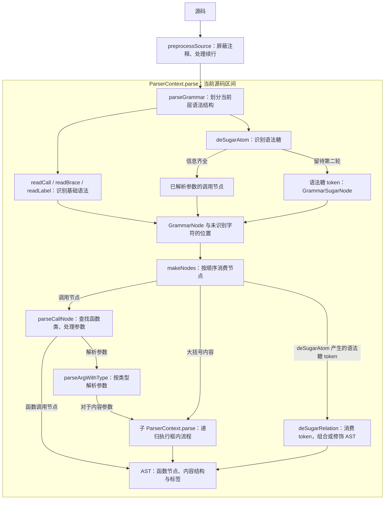

一段 `@div(1, n=2.8)` 是怎样变成“减时函数包含音符函数”的树的？顺着这个调用，可以看到解析器如何识别语法、读取函数声明，以及把参数交给构造函数。本节从这条路径出发，再看简写 `1/` 如何接入同一套流程，以及编辑器怎样复用其中的语法分析能力。实现入口在 [ParserContext](https://github.com/madderscientist/jpFun/blob/HEAD/packages/jpfun/src/parser/parserContext.ts)。

## 从文本到 AST 的处理流程

先把解析过程分成两步来看：**找到当前层的语法边界，再把这些结构变成 AST 节点**。它们分别对应 `ParserContext.parse()` 中的 `parseGrammar()` 和 `makeNodes()`。遇到内容参数或大括号时，解析器会为内部区间创建子上下文，再走一遍这两步。



解析是递归进行的；每次解析都是在当前“层”进行的：
1. 预处理负责删除注释和处理换行的转义。
2. `parseGrammar` 负责解析当前层中源码的 jpFun 基本语法，包括内容块 `{}`、函数调用 `@fn(...)`、标签 `@label`：
    - 如果遇到空格等，直接跳过。
    - 如果遇到 `{` 则开始内容块区间的识别，直接找到对应的 `}` 结束位置。
    - 如果遇到 `@fn(...)` 则识别函数调用，提取函数名和参数区间。
    - 如果遇到 `@label` 则识别为标签，记录标签位置。
    - 遇到其他字符，则尝试所有语法糖识别函数，若匹配成功则生成相应的语法糖节点，否则保留为未识别字符。
3. `makeNodes` 按顺序消费 `parseGrammar` 生成的节点，构造 AST，并处理语法糖关系。暴露给这一轮的是整个 `parseGrammar` 生成的节点列表、当前要处理的位置，以及已经得到的AST节点列表。
    - 如果是内容块节点，则创建子解析器并递归处理内容（从 `parseGrammar` 开始）。
    - 如果是函数调用节点，则调用 `parseCallNode` 解析函数名和参数，并将结果传给构造函数。注意，这里的参数解析是根据期望类型进行的。如果是内容参数，处理方式同上一条：递归解析。
    - 对于语法糖节点，遍历所有语法糖hook尝试消费，直接生成相应的 AST 节点。
    - 剩下字符是无法被语法消费的，则合并成 `ASTTextNode`，保留源码位置以便后续处理。


## 函数定义

解析器怎样知道 `1` 要当作内容，而 `2.8` 要当作数字？答案在函数类的静态 `def` 中。函数类注册后，解析器便能根据调用名找到这份声明。[DivFunction](https://github.com/madderscientist/jpFun/blob/HEAD/packages/jpfun/src/functions/div/index.ts) 与参数解析有关的定义如下，这里省略了 `description`、`example` 等文档元数据：

```ts
static override def = {
    name: ["div", "/"],
    allowExtraArgs: false,
    args: [
        { type: "content" as const, default: null },
        { name: "n", type: "number" as const, default: 1 },
        { name: "autobeam", type: "boolean" as const, default: true },
    ],
};
```

读这份声明时，可以先看 `name`：`@div(...)` 和 `@/(...)` 都会找到这个类。再看 `args`，第一个参数没有名称，只能按位置传入，类型是 `content`；`default: null` 表示它是必填项。后面的 `n` 和 `autobeam` 可以按位置或名称传入，分别接受数字和布尔值。省略它们时，构造阶段会结合上下文设置和默认值补齐。`allowExtraArgs: false` 则让解析器对额外参数给出诊断并跳过。

这里的别名 `/` 对应带 `@` 的显式调用。裸写在音符后面的 `/`，由后文的语法糖钩子识别。

### 一次调用如何变成节点

现在继续处理 `@div(1, n=2.8)`。`parseGrammar` 已经给出了参数区间，`parseCallNode` 根据 `def` 确定类型，再调用 `parseArgWithType`：内容 `1` 交给子解析器，得到音符节点；文本 `2.8` 按 `number` 转成数字。得到的 `FunctionArgs` 是一份映射，其中有 `0 → 音符节点` 和 `"n" → 2.8`。解析器将这份映射、整个调用的源码区间和当前 `ParserContext` 一起交给 `DivFunction` 构造函数。

构造函数首先要把参数取齐。它调用基类的 [`getArgValue(args, ctx)`](https://github.com/madderscientist/jpFun/blob/HEAD/packages/jpfun/src/functions/ASTtypes.ts)，按声明顺序取值。以省略的 `autobeam` 为例：没有显式传参，就去当前上下文查找 `div.autobeam`；如果也没有设置，才使用默认值 `true`。因此，在调用前写下 `@set(div.autobeam=false)`，就会让这个节点保存 `autoBeamEnabled = false`。

完整的取值顺序是：**显式命名参数 → 显式位置参数 → 上下文中的 `函数主名.参数名` → 声明默认值**。第一个内容参数没有名称，只查位置参数和默认值；如果最终仍得到 `null`，就报告缺少必填参数。

接下来轮到函数自身的规则。解析器已经把 `2.8` 转成了数字，而减时线数量需要是非负整数。`DivFunction` 构造函数执行 `Math.max(0, Math.trunc(this.n))`，把它修正为 `2`，并记录 `W_DIV_INVALID_N` 警告。构造函数还会保存内容节点，将其 `parent` 指向自己，并保存本次取到的自动连线设置。

顺着这个例子就能看清三者的分工：**函数定义提供调用约定，解析器完成通用的结构和类型解析，构造函数补齐参数并落实具体函数的规则**。编写新函数时，可以把已有类型的解析交给解析器，将自己的校验和节点初始化放在构造函数中。

到这里，AST 已经保存了“给这个音符加两级减时”的含义。随后 Lowering 才会按 `n` 缩短时值并产生装饰数据，布局与绘制阶段再确定减时线的位置和线段。

## 语法糖解析

理解显式调用后，再看简写 `1/`。它也要形成“div 包含 note”的树，但源码里没有函数名和括号。要完成这件事，函数类需要参与前面那两轮解析：先认出字符表达了什么，再确定它与周围节点的关系。

语法糖识别的结果直接进入节点构建过程，源码位置始终指向原来的简写。处理范围也沿用基本语法的边界：例如 `@div(1/, 2)` 中，外层先识别完整调用，等第一个参数被确定为 `content` 后，子解析器才会处理其中的 `1/`。

### 函数注册与两轮钩子

要让解析器识别这些简写，函数类可以实现 `deSugarAtom` 和 `deSugarRelation` 两个静态钩子。`registerFunctions()` 注册函数名及别名，`getDeSugarFns()` 再按函数类去重并收集钩子。像 div 这样有多个别名的函数，也只会提供一套语法糖规则。

两轮之间传递的内容，可以用下面这张表对照：

| 钩子 | 调用阶段 | 可用信息 | 返回值 |
| --- | --- | --- | --- |
| `deSugarAtom(source, start, end, depth)` | `parseGrammar` 扫描当前位置时 | 源码、扫描区间、作用域深度 | `{ node, next }`；`next` 是下一个字符位置 |
| `deSugarRelation(ctx, nodes, at)` | `makeNodes` 遇到 `kind: "sugar"` 时 | 解析上下文、当前层中间节点序列、已构造的 AST | 下一个待处理的节点下标 |

编写钩子时，遇到自己不识别的输入就返回 `null`，让解析器继续尝试下一个钩子。尝试顺序与收集顺序一致，第一个匹配结果会被采用。

### parseGrammar：识别结构

扫描 `1/` 时，基本语法没有匹配当前位置，`parseGrammar` 便依次尝试 `deSugarAtom`。音符钩子看到 `1`，仅凭这段文本就能确定音符参数，于是直接返回 `kind: "call"`、`typed: true` 的调用节点，带上函数名和已解析的参数。

扫描到 `/` 时，div 钩子能数出减时线层数，却还需要知道它修饰谁。于是它返回 `kind: "sugar"` 的 `GrammarSugarNode`，在 `data` 中记下层数，留待第二轮结合前方节点。这里的 `deSugarAtom` 只读取源码；需要当前变量或 AST 的工作，都放到第二轮。

每次匹配还会返回 `next`，告诉扫描器从哪个字符继续。这样得到的序列类型是 `(GrammarNode | number)[]`：识别成功的部分保存为 `GrammarNode`，其余字符保存源码下标。保留换行也有用途，后面解析声部时就会用它判断内容何时结束。各类节点的字段可以查阅 [grammarType.ts](https://github.com/madderscientist/jpFun/blob/HEAD/packages/jpfun/src/parser/grammarType.ts)。

### makeNodes：建立节点关系

现在，`makeNodes` 拿到一个 note 调用节点和一个 div 标记。它先将 note 交给 `parseCallNode`。因为这个调用已经标记为 `typed`，参数会直接传入音符构造函数；普通显式调用则仍要经过前面介绍的类型解析。

接下来遇到 div 标记，`makeNodes` 开始尝试 `deSugarRelation`。**这个钩子消费的正是 `deSugarAtom` 产生的语法糖 token，也就是 `GrammarSugarNode`**，其中保留了简写的源码区间和待处理数据。这里的 token 用来构建节点关系；后文编辑器使用的 `SyntaxToken` 则用来描述着色类别和区间。

关系钩子收到两份有用的信息：`ctx.nodes` 中是前面已经构造的 AST，`nodes` 中是当前层的中间节点序列。div 钩子因此能从 `ctx.nodes` 取得刚构造好的音符，将它包装成 div 节点；如果前方已经是 div，就累加减时层数。到这里，`1/` 已经形成与显式调用相同的树形结构。

其他关系钩子也可以利用这些信息修改解析状态，或从 `nodes` 中划出一段后续内容，再交给子上下文的 `makeNodes` 处理。钩子把结果写入上下文后，返回下一个待处理的**节点下标**。实现时尤其要留意这个单位：第一轮 `next` 指向的是**源码字符位置**。如果所有关系钩子都未匹配，标记会保留为文本节点。

### 需要向后读取的简写

`1/` 展示了两种情况：音符 `1` 读取自身文本就能确定参数，减时线 `/` 需要结合前方节点。还有第三种情况，例如声部起点 `N:`，它需要继续读取后方内容。

处理 `N:` 时，第一轮先记录声部起点和名称。第二轮从标记之后向后查找，遇到换行或下一个声部组件标记就确定内容终点；如果一直没有遇到终止符，就取到当前序列末尾。然后将这段中间节点交给子上下文的 `makeNodes`，用得到的内容创建 voice 节点。

设计一种新简写时，可以先判断它需要哪类信息：只读自身文本、结合前方对象，还是读取后方区间。这样就容易决定第一轮要记录什么、第二轮再完成什么。同一个函数也可以按具体写法提供不同的处理方式。

## 编辑器语法视图
编辑器里，用户可能刚输入 `@div(1, n=`，就需要参数提示和高亮。这时调用还没写完，语法分析仍然可以识别函数名、参数名和已有的边界。为此，解析器提供了 `SyntaxAnalysis`，将这些信息交给高亮、补全和函数文档悬浮使用。它的主要结构如下，完整定义见 [grammarType.ts](https://github.com/madderscientist/jpFun/blob/HEAD/packages/jpfun/src/parser/grammarType.ts)：
```ts
interface SyntaxAnalysis {
    tokens: SyntaxToken[];   // 着色区间
    calls: CallInfo[];       // 调用与参数边界，供补全定位
}
```

这些信息在语法扫描阶段收集。根上下文创建 `ParserContext.syntax` 后，参与 `parseSyntax` 的子上下文会把各自发现的内容写入同一份结果，嵌套调用的区间也就能一起返回给编辑器。

### 两个入口，共用一套语法
接入时，可以根据任务选择入口。需要编译曲谱，就调用 `compileScore(source)`：它通过 `parse()` 构造 AST，再继续 Lowering 和布局，这条路径不读取或填充 `syntax`。需要编辑器语法信息，就调用 `analyzeScoreSyntax(source)`：它通过 `parseSyntax()` 扫描语法结构，返回 `{ syntax, diagnostics }`，到此即可，不需要构造 AST。

两条路径共用 `parseGrammar`。其中的 `syntaxOnly` 开关决定是否记录 token，以及如何处理未闭合调用、命名参数顺序错误。对于刚才尚未写完的输入，词法模式会记录诊断并继续扫描，让编辑器仍然拿到可用信息。

维护解析器时，需要让两条路径沿用相同的语法识别规则；测试也会检查同一份源码在两种模式下得到的 `GrammarNode` 形状是否一致。这样，编辑器理解的语法才能与实际编译保持同步。

### token 从哪里来
仍以 div 调用为例，`readCall` 已经找到了函数名、括号和参数区间。词法路径只需利用这些边界，就能把 `@div` 标成函数、`n` 标成参数名，把括号、逗号和等号标成标点。其他 token 也从相应的语法结构取得：

| 来源 | 产出 |
| --- | --- |
| `preprocessSource` 的 `commentSpans` | `comment` |
| `readCall` 的 `CallInfo` | `function`（`@name`）、`punctuation`（括号/等号/逗号）、`property`（参数名）、以及按类型分类的参数值 |
| `readLabel` | `label` |
| 大括号节点 | `punctuation` |
| 语法糖节点与 typed 调用 | `operator`，或节点自己声明的 `syntaxKind` |

如果要实现参数补全，可以进一步查看 `readCall` 给出的 `CallInfo`：它记录调用名、左右括号，以及每个参数的 `span`、`nameSpan`、`equalsSpan`、`commaSpan` 和 `valueSpan`。AST 路径把这些区间交给 `parseCallNode` 读取参数，词法路径用它们记录调用信息并生成 tokens，两者共享同一组边界。

处理未写完的调用时，要允许 `closeParenSpan` 缺失。`readCall` 会把已识别的部分返回，由上层决定记录诊断还是抛出错误。

前面的等长预处理在这里也发挥了作用：所有 offset 都与原始源码对齐，可以直接定位到编辑器文本。输出的 tokens 按起点升序排列，没有嵌套、重叠或空区间，因此可以交给要求有序输入的 `RangeSetBuilder`。

### 声明着色角色
给新函数添加语法糖时，还可以通过 `GrammarNodeBase.syntaxKind` 指定它的着色角色。语法糖节点和 typed 调用默认使用 `operator`；像普通音符这样独立成元素的原子简写，可以标为 `atom`。解析器读取这个字段后，就能为新简写生成对应的 token。

## 参数类型如何复用
前面用 `def.args` 告诉解析器，div 的第一个参数是内容、`n` 是数字。这份类型声明也供高亮和补全使用：AST 构建、高亮和补全都会通过 `resolveArgType(def, name, index)` 查找参数类型。遇到 `content` 就继续递归分析，其他参数则按对应类型着色。

有些函数允许数量不定的位置参数，可以在允许额外参数的同时声明 `extraArgType`，为这些位置统一指定类型。例如 `@tie` 使用 `label`，`@up` 使用 `content`。这样，即使参数超出了 `args` 的固定列表，`parseCallNode` 仍知道怎样读取它，编辑器也知道怎样分析它。这个规则只覆盖额外的**位置参数**；命名参数仍按名称查找 `args` 中的声明。

再看 `@set(fontsize=30)`：`fontsize` 这样的动态命名参数没有固定声明，源码分析会尝试用 `Number()`、`parseLength()` 判断字面量类型。未知函数的参数也会采用这条路径。复用实际的解析函数，可以让 `-3`、`.5em` 等写法的着色与解析行为保持一致。

在 AST 路径中，如果函数允许额外参数，而某个参数又无法从声明中确定类型，解析器会保留它的 `CallArgumentInfo`，将名字和值的源码区间一起交给构造函数。实现 `@tie`、`@voice` 这类函数时，就需要区分已经解析的值和仍待自行解析的参数。

## 为两条路径分别创建上下文
如果同时需要曲谱和编辑器信息，分别调用两个入口即可。接入时很容易想到让它们复用一次扫描结果，但当前实现中的中间节点带有可变状态，需要先留意它们的生命周期。

`addSyntax` / `recordSyntax` 直接引用 `GrammarNode` 的 span。词法路径会保持这些区间，AST 路径中的 `makeNodes` 则可能修改它们，例如展开 `^` 时需要扩展节点的源码范围。如果两条路径共享同一批节点，构建 AST 就可能连带改动已经交给编辑器的语法区间。

因此，**不要对同一个 `ParserContext` 先调用 `parseSyntax` 再调用 `parse`**，`GrammarNode` 也不能跨次解析复用。将来要做增量解析或缓存扫描结果时，需要先解决这些可变区间的共享问题，再决定哪些结果可以保留。
