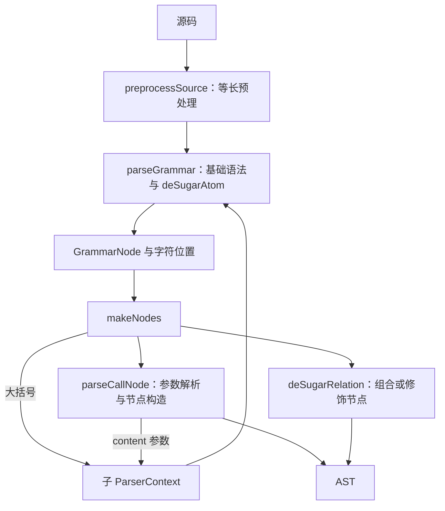

解析器负责识别源码结构、按函数声明读取参数，并将显式调用和语法糖构造成 AST。实现入口是 [ParserContext](https://github.com/madderscientist/jpFun/blob/HEAD/packages/jpfun/src/parser/parserContext.ts)；编辑器的语法分析也复用其中的结构识别过程。

## 从文本到 AST 的处理流程

`ParserContext.parse()` 分两轮工作：`parseGrammar()` 划分当前层的语法结构，`makeNodes()` 按顺序构建 AST。内容参数和大括号通过子上下文递归解析。


```mermaid
flowchart TB
  Source["源码"] --> Preprocess["preprocessSource：等长预处理"]
  Preprocess --> Grammar["parseGrammar：基础语法与 deSugarAtom"]
  Grammar --> Nodes["GrammarNode 与字符位置"]
  Nodes --> Make["makeNodes"]
  Make --> Call["parseCallNode：参数解析与节点构造"]
  Make --> Relation["deSugarRelation：组合或修饰节点"]
  Make -->|大括号| Child["子 ParserContext"]
  Call -->|content 参数| Child
  Child --> Grammar
  Call --> AST["AST"]
  Relation --> AST
```

1. **预处理**：等长屏蔽注释、处理续行，并将字符串外的 CRLF 转成 ` \n`。字符串内的 CRLF 保持原样，`lineStarts` 记录原文行首位置，所有 `SourceSpan` 与原文对齐。
2. **识别结构**：`parseGrammar` 用 `readCall`、`readBrace`、`readLabel` 识别调用、内容块和标签，并尝试语法糖钩子。结果为 `(GrammarNode | number)[]`，其中数字保存剩余字符的源码位置，包括用于划分内容的换行。
3. **构建节点**：`makeNodes` 依次构造调用、递归解析内容块、绑定标签、处理语法糖关系，并把剩余字符合并成 `ASTTextNode`。

## 函数声明与参数绑定

函数类的静态 `def` 定义调用名、参数类型和默认值。以 [DivFunction](https://github.com/madderscientist/jpFun/blob/HEAD/packages/jpfun/src/functions/div/index.ts) 为例：

```ts
static override def = {
    name: ["div", "/"],
    allowExtraArgs: false,
    args: [
        { type: "content" as const, default: null },
        { name: "n", type: "number" as const, default: 1 },
        { name: "autobeam", type: "boolean" as const, default: true },
    ],
};
```

`name` 注册主名和别名，`@div(...)` 与 `@/(...)` 因而对应同一个类。`args` 按声明顺序列出固定参数：

| 声明 | 绑定方式 |
| --- | --- |
| 省略 `name` | 按位置传入 |
| 指定 `name` | 按位置或名称传入 |
| 指定 `name` 和 `namedOnly: true` | 仅按名称传入 |

位置编号只计算普通参数，`default: null` 表示必填。`allowExtraArgs` 控制额外参数，`extraArgType` 指定额外位置参数的类型。例如 `@tie(a, b, height=0.5em)` 的端点使用额外位置参数，`height` 使用仅命名参数。

[ASTtypes.ts](https://github.com/madderscientist/jpFun/blob/HEAD/packages/jpfun/src/functions/ASTtypes.ts) 提供共享查询：

- `resolveArgDef(def, name, index)` 按名称或零基位置索引返回参数声明，名称匹配忽略大小写。
- `resolveArgType(def, name, index)` 返回声明类型，额外位置参数按 `extraArgType` 处理。

AST 解析、语法着色和编辑器提示都使用这份类型信息。`content` 参数递归解析，其他参数按对应类型读取；允许的动态参数以 `CallArgumentInfo` 保留源码区间，交给构造函数处理，例如 `@set` 的设置项。

### 一次调用如何变成节点

以 `@div(1, n=2.8)` 为例：

1. `readCall` 提取函数名和参数区间。
2. `parseCallNode` 查询声明，调用 `parseArgWithType`：将 `1` 递归解析为音符节点，将 `2.8` 转为数字。
3. 解析器把 `FunctionArgs` 映射 `{ 0 → 音符节点, "n" → 2.8 }`、调用区间和上下文交给构造函数。
4. 构造函数用 `getArgValue(args, ctx)` 取齐固定参数，完成自身校验并设置子节点的 `parent`。此例将 `n` 修正为 `2`，同时记录 `W_DIV_INVALID_N`。

`getArgValue` 按声明顺序返回值，优先级为：**显式命名值 → 显式位置值 → 作用域中的 `函数主名.参数名` → 声明默认值**。仅命名参数跳过位置查找；仅位置参数查询位置值和默认值。取值保留 `0`、`false` 和空字符串，必填项缺失时给出诊断。

### 子上下文与作用域

内容参数和 `{...}` 各自创建子 `ParserContext`。子上下文复制变量表、增加 `scopeDepth`，并独立保存待构建的 AST；函数注册表、诊断和标签候选表由父子上下文共享。这样，局部设置沿嵌套作用域继承，标签和诊断则在整个文档中收集。

解析阶段保存节点结构和参数值，后续的 Lowering、布局与绘制分别处理时间关系和视觉结果。

## 语法糖解析

语法糖直接参与两轮解析，生成与显式调用相同的 AST 结构，`sourceSpan` 指向原来的简写。处理范围由当前内容层级决定，例如 `@div(1/, 2)` 中的 `1/` 在第一个参数的子上下文中解析。

### 函数注册与两轮钩子

函数类通过两个静态钩子参与解析。`registerFunctions()` 注册函数名及别名，`getDeSugarFns()` 按类去重并收集钩子：

| 钩子 | 调用阶段 | 可用信息 | 返回值 |
| --- | --- | --- | --- |
| `deSugarAtom(source, start, end, depth)` | `parseGrammar` 扫描当前位置时 | 源码、扫描区间、作用域深度 | `{ node, next }`；`next` 是下一个字符位置 |
| `deSugarRelation(ctx, nodes, at)` | `makeNodes` 遇到 `kind: "sugar"` 时 | 解析上下文、当前层中间节点序列、已构造的 AST | 下一个待处理的节点下标 |

钩子按注册顺序尝试，采用第一个匹配结果；返回 `null` 时继续尝试下一个。第一轮的 `next` 是**源码字符位置**，第二轮返回的是**中间节点下标**。

两轮之间通过 `GrammarSugarNode` 传递标记、数据和源码区间。第二轮同时持有 `ctx.nodes`（已构造的 AST）与 `nodes`（当前层的中间节点），因此可以处理标记两侧的内容。节点定义见 [grammarType.ts](https://github.com/madderscientist/jpFun/blob/HEAD/packages/jpfun/src/parser/grammarType.ts)。

### 原子解析：`1`

音符钩子仅凭字符就能确定参数，直接返回 `kind: "call"`、`typed: true` 的调用节点。第二轮将这些参数交给构造函数，得到音符 AST。普通显式调用的参数则由 `parseCallNode` 按声明解析。

### 前向消费：`1/`

这里的“前方”指源码中标记左侧、已经构造的节点。[DivFunction](https://github.com/madderscientist/jpFun/blob/HEAD/packages/jpfun/src/functions/div/index.ts) 的处理分两步：

1. `deSugarAtom` 统计连续 `/` 的数量，将层数写入 `GrammarSugarNode.data`。
2. `deSugarRelation` 从 `ctx.nodes` 查找前一个内容节点，将它包装成 div；目标已经是 div 时，直接累加层数。

结果是 div 包含 note，包装节点的 `sourceSpan` 覆盖音符和减时标记。关系钩子更新 `ctx.nodes` 后，返回标记之后的节点下标。

### 后向解析：`1 ^ 3/`

`^` 同时需要左右两侧的 AST。[UpFunction](https://github.com/madderscientist/jpFun/blob/HEAD/packages/jpfun/src/functions/up/index.ts) 先取得左侧节点，再递归解析标记后方的中间节点：

1. 第一轮识别 `^`，生成关系标记。
2. 第二轮从 `ctx.nodes` 取得左操作数，保存当前 AST 列表。
3. 临时切换到空 AST 列表，调用 `ctx.makeNodes(nodes, at)` 解析当前层的剩余序列，再取首个非文本节点作为右操作数。此例中，`3/` 已经组合成完整的 div 节点。
4. 合并左右操作数，接回余下的 AST，恢复列表，并返回 `nodes.length`，表示后续序列已处理完毕。

`&` 使用相同的后向解析方式，将两侧内容组合成 stack。这里复用当前上下文，以共享变量和标签状态。

### 有界消费：`N: 1 2 3`

有明确终止条件的简写可以先划定区间，再解析内容。[VoiceFunction](https://github.com/madderscientist/jpFun/blob/HEAD/packages/jpfun/src/functions/voice/index.ts) 的第一轮记录 `N:` 起点和名称；第二轮扫描到当前层的换行、下一条声部声明或序列末尾，截取这段中间节点，交给子上下文的 `makeNodes`，最后构造 voice。

这几种方式分别适合：参数由文本直接确定、修饰前方节点、组合后方节点，以及收集有边界的内容。

## 编辑器语法视图

`analyzeScoreSyntax(source)` 通过 `parseSyntax()` 产出编辑器所需的结构：

```ts
interface SyntaxAnalysis {
    tokens: SyntaxToken[];   // 着色区间
    calls: CallInfo[];       // 调用与参数边界，供补全定位
}
```

它与 `compileScore(source)` 共用 `parseGrammar`：前者在扫描时收集调用和着色区间，后者通过 `makeNodes` 构造 AST，再继续 Lowering 和布局。`syntaxOnly` 模式会记录输入中的语法诊断并继续扫描，例如 `@div(1, n=` 可以提供已有的函数名和参数边界。

### token 与调用区间

`recordSyntax` 将识别出的结构映射为编辑器 token，内容参数和大括号通过子上下文递归收集：

| 来源 | 产出 |
| --- | --- |
| `preprocessSource` 的 `commentSpans` | `comment` |
| `readCall` 的 `CallInfo` | `function`、`punctuation`、`property` 和按类型分类的参数值 |
| `readLabel` | `label` |
| 大括号节点 | `punctuation` |
| 语法糖节点与 typed 调用 | `operator`，或节点声明的 `syntaxKind` |

参数值使用声明类型着色，动态参数通过 `Number()`、`parseLength()` 等判断字面量类型。语法糖可设置 `GrammarNodeBase.syntaxKind`，例如普通音符使用 `atom`，关系标记使用默认的 `operator`。

`CallInfo` 保存调用名、括号和各参数的 `span`、`nameSpan`、`equalsSpan`、`commaSpan`、`valueSpan`。正在输入的调用允许 `closeParenSpan` 缺失。根上下文汇总各层结果，按起点排序，供高亮、补全和参数提示使用；具体接入见[编辑器](../editor/)。

### 解析结果的生命周期

每次 AST 解析和语法分析各自创建上下文与中间节点。`recordSyntax` 引用识别阶段的 span，语法糖构建 AST 时则会调整节点范围；分别调用 `compileScore` 和 `analyzeScoreSyntax`，即可让两类结果各自持有对应的源码区间。
