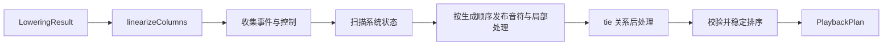

Playback 从 `LoweringResult` 编译播放计划。它与 Layout 使用相同的输入：Layout 计算页面几何，Playback 生成与设备无关、可转换为 MIDI 的定时事件。

## 三种时间坐标

| 坐标 | 含义 | 典型用途 |
| --- | --- | --- |
| 记谱时间（score） | 对象在原谱中的音乐位置，以 QN 为单位 | 关联 Lowering 事件与谱面位置 |
| 演奏时间（performance） | 按实际演奏顺序展开后的位置，以 QN 为单位 | 编排反复、房子与演奏事件 |
| 秒时间 | 沿演奏时间上的 Tempo 积分得到的实际时间 | 设备调度与播放进度 |

记谱时间与演奏时间均使用精确的 `Fraction` 表示。反复使同一记谱位置对应多次演奏访问；Tempo 决定 QN 到秒的换算，不改变事件的 QN 位置。

`scoreMap` 记录演奏时间到记谱时间的分段映射，供播放进度关联原谱。`secondsToScoreTime(plan, seconds)` 先按速度换算，再映射回记谱位置；输入限制在计划时长内，不向谱面之外外推。

## 计划与设备的边界

`PlaybackPlan` 保存完整编译结果，包括事件、轨道、时间映射与诊断，可以同时服务于实时播放和文件导出。

Web Audio、Web MIDI 和 Standard MIDI File 适配器消费同一事件计划。设备选择、PPQ 量化、实时调度和文件编码属于适配器，不应重新解释反复、房子或装饰音。布局几何也不参与事件生成，只有应用层的播放指示需要把时间映射回谱面。

## 编译入口与输出

使用 `compilePlayback` 编译播放计划：
```ts
compilePlayback(lowering, options?): PlaybackPlan
```

`options.maxFlowSteps` 限制反复、房子等控制流访问时间列的次数，默认 65,536，必须是正安全整数。超过上限时抛出 `E_PLAYBACK_FLOW_LIMIT`，不返回部分计划。

| `PlaybackPlan` 字段 | 内容 |
| --- | --- |
| `events` | 按演奏时间排序的定时事件 |
| `scoreMap` | 演奏位置到原谱位置的映射 |
| `tracks` | 最终实际发声的轨道 |
| `performanceDuration` | 展开后的总演奏时值，单位 QN |
| `durationSeconds` | 结合 Tempo 后的总秒数 |
| `diagnostics` | 播放编译产生的可恢复诊断 |

## 事件与轨道

音符用事件对表示，不另存一份 `start + duration`。一个有时长的音符对应两个共享 `noteId` 的事件：
```text
NoteOn(at, noteId, track, midi, velocity, percussion?)
NoteOff(at, noteId, track, midi)
TimeSignature(at, numerator, denominator)
ProgramChange(at, track, program)
```

`PlaybackPlan.events` 当前包含 `tempo`、`time-signature`、`program-change`、`note-on`、`note-off`。同一时刻按 `tempo -> time-signature -> program-change -> note-off -> note-on` 排序，同类事件保持来源顺序。拍号不参与 QN 到秒的积分，只供 MIDI、节拍显示等设备适配器使用。

普通 NoteOn 的 `midi` 保留核心按记谱语义计算出的逻辑音高；`percussion: true` 时则表示打击键号。播放编译器不限制其范围，也不将其整数化；MIDI 适配器负责转换为目标设备接受的表示。

编译期间，NoteOn 引用与布局相同的 Track 对象。`lowering.tracks` 完整描述视觉拓扑，可以包含 head 槽位、只含休止符的声部等无发声轨。

控制流、ornament、dash 和 tie 处理完成后，Playback 按 `lowering.tracks` 的稳定顺序筛选轨道，只保留最终事件中至少含一个 NoteOn 的 Track。输出的 `tracks` 从 0 开始连续编号，`events[].track` 是该数组的索引。head 等纯布局轨、只含休止符的轨和被控制流完全跳过的轨都不占播放通道。

## 编译流程



编译器先扫描系统状态，建立完整的 Tempo 表，再按播放生成顺序发布音符。每个 Temporal 完整发布 NoteOn/NoteOff 后，立即执行为它保存的 transform 链；deferred hook 则在自身位置执行。

局部处理完成后，编译器整理事件，再执行 `PlaybackRelation`，最后校验并稳定排序。这个顺序保证 ornament 先展开，紧随其后的 dash 能找到颤音最后一个子音；dash 移动 NoteOff 后，tie 再根据最终边界判断音符是否连续。

局部 transform 和 deferred hook 都可以查询完整 Tempo 表，但只能访问截至当前位置已发布的音符事件。需要查看完整音符计划的功能应使用 `PlaybackRelation`。

## 控制流

`linearizeColumns` 输出实际访问的列号序列。反复可能让同一列出现多次，房子可能跳过某些列。每次节点访问都有独立的 origin 对象，同一个 Temporal 在反复中也会生成不同的事件和 `noteId`。

反复结束线回到此前最近的反复开始线。例如 `|: 1 |: 2 :| 3 :|` 展开为 `1 2 2 3 2 3`，与 MuseScore 一致。

`playbackMarks` 只能由进入时间流、拥有列位置的 Temporal 声明。attachment 可以通过 `playbackFlow(columnOf)` 用自身端点声明区间，但不能单独声明标记。

显式 flow 的 `range` 必须是时间列内的升序闭区间，`jump` 目标必须位于 `0..columns.length`，其中 `columns.length` 表示跳到文末。不符合要求时分别抛出 `E_PLAYBACK_FLOW_RANGE` 或 `E_PLAYBACK_FLOW_JUMP`。

`scoreMap` 记录控制流展开后的 performance QN 到原始 score QN 的映射。相邻点之间两者以 1:1 前进；反复和房子只表现为映射点处的 score 跳转。

## PlaybackEmitter

Temporal 通过 `emitPlayback(emitter)` 定义自身的播放行为：

```ts
interface PlaybackEmitter {
    readonly start: Fraction;
    readonly end: Fraction;
    readonly track: Track;

    nextNoteId(): number;
    emit(event: PlaybackEventInput): void;
    control(at: Fraction, apply: PlaybackControl): void;
    affectFollowing(transform: PlaybackTransform): void;
    defer(hook: PlaybackHook): void;
    play(child: TemporalNodeBase, start?: Fraction, duration?: Fraction): void;
}
```

- `emit` 发布系统定义的输出事件；note 通过它发布 NoteOn 和 NoteOff。
- `control` 在指定时刻修改播放系统状态。
- `affectFollowing` 为同一 play frame 中后续的音符事件添加局部变换。
- `defer` 在当前节点的 transform 完成后，于当前位置执行事件 hook。dash 使用它修改前一个音符。
- `play` 递归发布折叠成员；未指定区间时继承当前区间。

每个 play frame 维护一条局部 transform 链。同一 frame 内的兄弟节点共享这条链；子 frame 继承链的副本，在子 frame 中新增的 transform 不影响父级。

## 系统状态与控制事件

速度通过系统状态生成。`onTimeState` 先将记谱位置上的基础 BPM 保存到 `Temporal.playbackState`；每次实际访问 Temporal 时，编译器将这个快照同步到 `PlaybackSystemState`。tempo 函数本身不直接发布速度事件。

控制事件用函数描述状态修改，由系统调度执行：

```ts
type PlaybackControl = (state: PlaybackSystemState) => void;
```

有效速度为：

$$
effectiveBpm = baseBpm \times bpmScale
$$

fermata 在附属音符的首尾发布两个控制：

```ts
emitter.control(emitter.start, state => state.bpmScale.div(2));
emitter.control(emitter.end, state => state.bpmScale.mul(2));
```

这两个控制将覆盖区间的实际速度减半，不移动 NoteOn/NoteOff，也不暂停谱面进度。不同声部中部分重叠的音符只在重叠部分变慢；多个 fermata 重叠时，倍率相乘。

系统按时刻合并基础状态同步与控制函数，并在 effective BPM 改变时生成最终的 `tempo` 事件。反复回跳后，实际访问到的 Temporal 继续按自身 `playbackState` 更新系统。

program 同样先由 `onTimeState` 保存到记谱位置，默认值为 0。它按 Track 流动，不进入全局 `PlaybackSystemState`。编译器按实际访问顺序维护每轨当前 program，只在变化时生成 `program-change`。

反复回跳时，目标音符的快照会恢复对应音色，无需在全局系统状态中增加每轨状态表或跳转快照。目前尚不支持 ControlChange 和 PitchBend。

## Origin 与局部变换

每次调用 `play(node)` 都会创建一个独立的 origin 对象：

```ts
interface PlaybackOrigin {
    node: TemporalNodeBase;
}
```

同一个 Temporal 在反复中的不同访问通过对象身份区分，不使用额外的 occurrence 数字。编译期事件保存 origin lineage：ornament 替换事件时继承 lineage，tie 合并事件时取并集。

目标音完整发布后，局部 transform 接收这次访问产生的事件：

```ts
type PlaybackTransform = (
    context: PlaybackHookContext,
    events: PlaybackDraftEvent[],
) => PlaybackDraftEvent[] | void
```

accent 原地修改 `events`；ornament 返回替换后的事件数组，下一层 transform 继续处理这个结果。因此，局部修饰只需处理传入的事件，无需扫描完整事件计划。

`context.stateAt(time)` 按时刻查询 BPM 快照。defer 和 relation 需要跨节点访问事件时，使用 `context.events`：defer 执行时其中只有已发布的事件前缀，relation 执行时则包含完整音符计划。

tr、dash、tie 使用上述变换和关系接口，不定义专用的事件 kind。播放编译器也没有 Patch、Visitor 或 handler registry。

## 各函数的播放行为

### Note

note 根据已保存的音高、力度和 Track 发布一对 NoteOn/NoteOff。休止符 `0/Z` 和占位符 `8` 不发声，但仍推进 performance QN。

节拍记号 `9/X` 在发布 NoteOn 时指定 `midi=37` 和 `percussion: true`，其中 `midi` 表示 GM 打击键。普通 NoteOn 不携带该标记；NoteOff 仍通过 `noteId` 配对。它保留原 Track 和力度，不提供调内移调函数，所以重音生效、颤音和波音不展开。tie 只合并同种类的同键号音符。

浏览器合成和 MIDI 打击通道路由属于设备适配，详见[编辑器集成](../editor/)。它们不改变核心计划中的原声部身份。

力度和 program 在 `TimeState` 中按音轨各自流动（见 lowering 文档），所以 `$p`、`$f`、`@dyn` 和 `@program` 都只影响自己所在的声部，新声部则继承分叉处的状态；速度和调性仍整篇共享。

### Program

`@program(0..127)` 产生不可见的零时值 Temporal。它在 lowering 时修改当前 Track 的 program，后续音符保存各自位置的快照。播放编译同时使用 program 声明和音符快照，使顺序演奏与控制流跳转得到相同的音色结果。

### Meter

meter 发布 TimeSignature。与其他 Temporal 一样，事件按实际控制流访问生成，因此反复段内的拍号每遍都会出现，反复段外的拍号只出现一次。

core 保留任意正整数分母。Standard MIDI File 只能表示以 2 为幂的分母，MIDI 适配器在导出时检查这一限制。

### Up 与 Grace

up 按附属成员到宿主的顺序调用 `play`。grace 在宿主区间内计算借时，再用显式 start/duration 发布倚音和宿主。

### Accent 与 Ornament

accent、tr 和波音使用 `affectFollowing`。目标 Temporal 完整发布 NoteOn/NoteOff 后，立即依次执行为它保存的 transform 链：accent 修改 velocity，tr/波音将目标事件对替换为多对子音事件。

后一个 transform 继续处理前一个 transform 的派生事件，因此书写顺序会影响结果。

ornament 用 `stateAt(NoteOn.at).effectiveBpm` 决定极端速度下的密度。

### Dyn

`@dyn(from, to, dv)` 在 Lowering 阶段计算力度，不生成运行期 relation。所有 `onTimeState` 完成后，Lowering 遍历 `astToTemporal`，为普通音符以及 up/grace 的折叠成员累计力度增量。

区间内，增量按记谱时间从 0 线性变化到 `dv`；区间后保持完整增量，直到下一次原始力度变化。增量叠加在每个音符已保存的力度上，dyn 不识别 `$p`、`$f` 或其他具体函数。因此，区间内的力度记号仍独立生效，多条 dyn 的贡献按数值加法累计。

播放编译只根据 note 的 `playbackState.velocity` 发布 NoteOn。反复访问相同 Temporal 时，会重放同一条记谱力度曲线。

### Dash

dash 用 `defer` 捕获自身的 Track、start 和 end。顺序流执行到 dash 时，它从当前位置附近向前查找同轨且恰好位于 start 的 NoteOff，并将该事件移动到 end。

dash 本身有正时值，因此会在 lowering 时保存所在位置的 BPM。即使控制流直接跳到 dash，秒数积分仍使用该记谱位置的速度。

- `1 - -` 的 NoteOff 逐段移动到最后；
- `9 - -` 同样延长 NoteOff，但短促打击音的包络自然衰减，不重复敲击；
- `1^3 -` 同时移动和弦的全部 NoteOff；
- `1^$tr -` 只移动颤音最后一个子音的 NoteOff。

### Tie

tie 通过 attachment 的 `PlaybackRelation` 在所有节点 hook 之后执行。只有同轨、同音且前一个 NoteOff 与后一个 NoteOn 同时的事件才会合并。

合并时删除中间的 NoteOff/NoteOn，将最终 NoteOff 的 `noteId` 改为首音的 `noteId`，并合并 source spans 与 origin lineage。反复中的每次访问独立匹配，交叉声明的 tie 链也能沿 lineage 找到合并后保留的事件。

## 应用集成

应用可以按源码版本缓存播放计划，在源码变化后使旧计划失效。实时播放与 MIDI 导出复用同一计划，分别完成设备调度与文件编码；暂停、跳转、音量和音色覆盖等交互状态由应用管理。

playground 的计划生命周期、tinySynth 调度与 MIDI 编码策略见[编辑器集成](../editor/)。