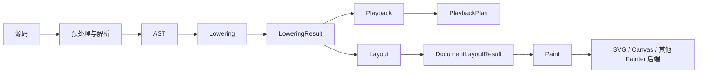

# 架构总览

jpFun 是一条面向简谱 DSL 的编译流水线：它把源码逐步转换为带时间语义的事件、可绘制的页面几何，最后交给不同渲染后端。

> 核心原则：框架只提供通用机制和调度，具体符号通过函数类声明自己的语法、时间、布局与绘制行为。

这个原则决定了系统的主要边界：引擎不识别音符、连音线或歌词等具体符号；函数只提供局部规则，不组织全局流程。

## 一眼看懂流水线



公共入口 [`compileScore`](../packages/jpfun/src/pipeline.ts) 串起前三个阶段，并保留所有中间结果。渲染是独立步骤，同一份布局可以交给多个后端。

| 阶段 | 输入与输出 | 只负责 | 不负责 | 代码与详解 |
| --- | --- | --- | --- | --- |
| 解析 | 源码 -> AST | 基础语法、参数固化、语法糖调度、源码位置 | 时间、坐标、绘制 | [`src/parser/`](../packages/jpfun/src/parser/) · [解析](parseAST.md) |
| Lowering | AST -> `LoweringResult` | 时间顺序、并行音轨、事件列、关系对象 | 像素坐标、绘制 | [`src/lowering/`](../packages/jpfun/src/lowering/) · [Lowering](lowering.md) |
| Playback | `LoweringResult` -> `PlaybackPlan` | 演奏手势、速度、延续关系、乐谱/演奏时间映射 | 音频设备、实时调度、像素坐标 | [`src/playback/`](../packages/jpfun/src/playback/) · [播放](playback.md) |
| Layout | `LoweringResult` -> `DocumentLayoutResult` | 测量、横纵向求解、分页、最终几何 | 语法解析、业务语义、后端 API | [`src/layout/`](../packages/jpfun/src/layout/) · [布局](layout.md) |
| Paint | 布局结果 -> 绘制命令 | 按层调用 `Painter` | 重新测量或改变布局 | [`src/render/`](../packages/jpfun/src/render/) · [渲染](render.md) |

编辑器在这四个阶段之外，另走一条只扫语法不建 AST 的轻量路径（`analyzeScoreSyntax`）：[编辑器集成](editor.md)。

阶段之间只通过显式数据结构通信。若一个改动需要反向读取后续阶段的状态，通常说明职责放错了层。

## 架构边界

### 引擎调度，函数声明

内置符号都位于 [`src/functions/`](../packages/jpfun/src/functions/)。一个函数类可以按需声明：

- 如何被解析，以及有哪些参数和语法糖；
- 如何产生时间事件、修饰作用域或建立并行关系；
- 如何测量自身、参与布局或附着到其他对象；
- 如何通过 `Painter` 发出绘制命令。

Parser、Lowering 和 Layout 只调用这些协议，不应针对具体函数名增加分支。新增符号通常只需新增函数目录，并在 [`defaultFunctions`](../packages/jpfun/src/functions/default.ts) 中注册。

### AST 只描述源码

AST 保存语法结构、已固化参数和源码位置。解析完成后，AST 保持只读；每次编译产生的时间、轨道和布局状态都写入新的中间对象。这样同一棵 AST 可以再次 Lowering，也不会携带上一次布局的临时状态。

### 时间、几何、绘制彼此分离

- Lowering 使用音乐时间和 Track，不计算像素。
- Playback 消费已固化的时间事件，展开演奏手势，不读取布局几何。
- Layout 消费已固化的事件关系，计算 `LayoutBox` 和页面坐标。
- Paint 只读取最终几何，不测量、不回写布局。

这使编辑器可以读取 AST，播放器可以读取 `LoweringResult`，而 SVG 与 Canvas 可以共享同一份布局。

### 核心对象各司其职

| 类型 | 何时使用 | 例子 |
| --- | --- | --- |
| `TemporalNodeBase` | 对象占据时间流，需要进入事件列 | 音符、小节线、控制事件 |
| `LayoutDecoration` | 对象只修饰单个主体，与主体共享位置 | 附点、减时线 |
| `LoweringAttachment` | 不推进时间的中立附属对象，由消费者读取具体能力 | tie、volta、声部大括号、页码 |
| `LayoutAttachment` | attachment 的可排版能力 | 连音线、连梁、歌词、box |

先选对对象类型，再实现 hooks，通常能避免把符号特例泄漏到核心引擎。

## 稳定的数据契约

| 契约 | 作用 | 定义位置 |
| --- | --- | --- |
| `ASTFunctionNode` | 函数定义、参数、去糖和阶段 hooks 的入口 | [`ASTtypes.ts`](../packages/jpfun/src/functions/ASTtypes.ts) |
| `LoweringResult` | 时间列、attachments、Track 树及 AST 到事件的索引 | [`lowering/types.ts`](../packages/jpfun/src/lowering/types.ts) |
| `LoweringAttachment` | 不推进时间的中立附属协议 | [`lowering/types.ts`](../packages/jpfun/src/lowering/types.ts) |
| `TemporalNodeBase` | 一次编译中的时间事件及其可选视觉主体 | [`lowering/types.ts`](../packages/jpfun/src/lowering/types.ts) |
| `PlaybackPlan` / `PlaybackEmitter` | MIDI 事件计划 / 函数事件声明接口 | [`playback/types.ts`](../packages/jpfun/src/playback/types.ts) |
| `LayoutBox` | 主体的尺寸、位置和对齐轴 | [`layout/types.ts`](../packages/jpfun/src/layout/types.ts) |
| `LayoutAttachment` | 跨主体关系的语义定义与横向准备协议 | [`layout/types.ts`](../packages/jpfun/src/layout/types.ts) |
| `AttachmentGeometry` / `PlacedAttachment` | 单次放置的原子几何 / 最终只读关系结果 | [`layout/types.ts`](../packages/jpfun/src/layout/types.ts) |
| `Painter` | 与 SVG、Canvas 无关的最小绘制接口 | [`render/types.ts`](../packages/jpfun/src/render/types.ts) |

这些契约比具体算法更适合作为扩展依据。弹簧模型、分页、Track 求解等实现细节应留在对应模块内部。

## 一个函数如何穿过系统

函数只实现自己真正需要的阶段：

| 需求 | 主要扩展点 |
| --- | --- |
| 定义函数和参数 | `ASTFunctionNode.def` |
| 实现语法糖 | `deSugarAtom` / `deSugarRelation` |
| 产生或组织时间事件 | `loweringEnter` / `loweringExit` / `timeFlowModel` |
| 在最终时间确定后固化状态（含速度、力度这类持续量） | `onTimeState` |
| 发布播放事件或递归展开折叠成员 | `emitPlayback` / `PlaybackEmitter.play` |
| 修饰同一 play frame 中后续的音符事件 | `PlaybackEmitter.affectFollowing` |
| 在演奏时刻修改系统状态 | `PlaybackEmitter.control` |
| 在当前位置处理此前已发布的播放事件 | `PlaybackEmitter.defer` |
| 给所在时间列贴播放标记 | `TemporalNodeBase.playbackMarks` |
| 决定反复、房子等播放顺序 | `PlaybackFlow.playbackFlow` |
| 观察完整播放计划或处理跨节点关系 | `PlaybackRelation.applyPlayback` |
| 扫描完整 lowering 结果或做最终校验 | `loweringAugment` / `loweringFinalize` |
| 创建主体几何 | `prepareLayout` / `finalizeLayout` / `onPlaced` |
| 创建局部装饰 | `layoutDecorationHandler` |
| 创建附属对象 | `LoweringAttachment` + 所需的 layout/playback 能力接口 |
| 绘制 | `paint(Painter)` |

典型生命周期如下：

```text
函数类解析源码
  -> 产生 Temporal 或 Attachment
  -> 引擎求解全局时间与位置
  -> 函数根据最终位置绘制
```

函数不需要完整经历每一步。例如设置类函数可以只有时间语义而没有 `LayoutBox`；装饰函数可以只写入 addon 并注册 decoration handler；附属函数可以只生成 attachment。

Attachment 与 Temporal 的阶段边界不同：`LoweringAttachment` 不进入时间列；layout 只消费实现 `LayoutAttachment` 的对象，playback 只消费控制或后处理能力。attachment 不一定是关系，例如声部大括号和页码只是布局附属物。主体坐标确定后由 `createGeometry` 生成可丢弃的单轮几何；最终 `PlacedAttachment` 才暴露 `box/regions/paint`。

## 改动应该放在哪里

| 改动 | 首选位置 |
| --- | --- |
| 新增或修改一种简谱符号 | `src/functions/<name>/` |
| 修改函数调用、标签、大括号等基础语法 | `src/parser/` |
| 修改通用时间归并、并行或 Track 机制 | `src/lowering/` |
| 修改通用演奏展开、速度积分或进度映射 | `src/playback/` |
| 修改通用测量、横纵向求解或分页 | `src/layout/` |
| 新增渲染后端或通用绘制能力 | `src/render/` |
| 修改公共编译入口或导出 | `src/pipeline.ts`、`src/index.ts` |

判断标准是“这是某个符号自己的规则，还是所有符号共享的机制”。前者留在函数目录，后者才进入核心模块。优先参考相同类型的现有实现，不要在引擎中加入符号名称判断。

## 跨阶段约定

- **诊断**：可恢复问题写入共享的 `diagnostics`；致命 `ErrorDiagnostic` 直接抛出。只有明确吞掉错误并继续的恢复点才记录该错误。
- **源码映射**：AST 节点保留 `SourceSpan`，后续对象通过来源 AST 追溯源码。
- **坐标与单位**：Lowering 的 `t/T` 是音乐时间；Layout 和 Painter 使用 px。局部端口相对所属 `LayoutBox`，attachment 区域使用全局坐标。
- **可重复性**：绘制只读；需要重新布局时，应从 AST 重新 Lowering，避免复用已被布局写入坐标的对象。

## 新贡献者阅读顺序

1. 从 [`src/pipeline.ts`](../packages/jpfun/src/pipeline.ts) 看完整数据流。
2. 阅读一个简单主体函数（如 [`bar`](../packages/jpfun/src/functions/bar/index.ts)），再按需求参考装饰函数 [`dot`](../packages/jpfun/src/functions/dot/index.ts) 或关系函数 [`tie`](../packages/jpfun/src/functions/tie/index.ts)。
3. 只深入与改动相关的专题文档：[解析](parseAST.md)、[Lowering](lowering.md)、[布局](layout.md)、[渲染](render.md)、[编辑器集成](editor.md)。
4. 在相邻测试中先描述期望行为，再修改实现。

常用验证命令：

```sh
pnpm run build
pnpm test
pnpm run typecheck
pnpm run test:update       # 确认新几何值无误后重写快照基线
```

测试按源码模块划分，一个模块一个 `packages/jpfun/test/<模块>.test.ts`；只跑其中一个用
`pnpm --dir packages/jpfun exec node --import tsx --test test/beam.test.ts`。
提交前至少运行构建和受影响阶段的测试。跨阶段改动应运行完整 `pnpm test`。