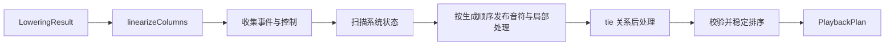

# 播放

Playback 与 Layout 并列消费 `LoweringResult`。Layout 生成页面几何，Playback 生成与设备无关、可直接翻译成 MIDI 的时刻事件。

入口只有一个：
```ts
compilePlayback(lowering, options?): PlaybackPlan
```

`options.maxFlowSteps` 限制反复、房子等控制流最多访问多少个时间列，默认 65,536。它必须是正安全整数；超过预算会抛出 `E_PLAYBACK_FLOW_LIMIT`，不会返回残缺计划。

## 事件是唯一事实来源
音符没有另一份 `start + duration` 表示。一个有时长的音符由共享 `noteId` 的两个事件组成：
```text
NoteOn(at, noteId, track, midi, velocity)
NoteOff(at, noteId, track, midi)
```

最终 `PlaybackPlan.events` 当前只含 `tempo`、`note-on`、`note-off`。同一时刻固定按 `tempo -> note-off -> note-on` 排序，同类保持来源顺序。

NoteOn 的 `midi` 保留核心按记谱语义计算出的逻辑音高，不在这里钳制或整数化；具体 MIDI 适配器负责转换为目标设备接受的音高表示。

`track` 是稳定的播放通道编号，与布局使用的视觉 Track 是同一个身份。渲染和播放共享这份分轨结果，不再维护第二套轨道映射。

## 编译流程



系统状态先完成扫描，Tempo 表因此可供所有局部处理查询。随后按播放生成顺序发布音符：一个 Temporal 完整发布 NoteOn/NoteOff 后立即执行它冻结的 transform，deferred hook 在自身位置执行。这样 ornament 先展开，紧随其后的 dash 才能找到颤音最后一个子音；dash 先移动 NoteOff，tie 才能按最终边界判断连续。

局部 transform 和 deferred hook 可以看到完整 Tempo 表，但音符事件只包含当前位置此前已经发布的前缀。需要观察完整音符计划的功能使用 `PlaybackRelation`。进入 relation 前整理一次事件，所有 relation 完成后再做最终排序。

## 控制流

`linearizeColumns` 输出实际访问的列号序列。反复会让同一列出现多次，房子会让某些列不出现。每次节点访问都有独立 origin 对象，同一个 Temporal 在反复中会生成不同的事件和 `noteId`。

反复结束线回到此前最近的反复开始线。例如 `|: 1 |: 2 :| 3 :|` 展开为 `1 2 2 3 2 3`，与 MuseScore 一致。`playbackMarks` 只属于进入时间流、天然拥有列位置的 Temporal；attachment 可以通过 `playbackFlow(columnOf)` 用自己的端点声明区间，但不能单独贴标记。

显式 flow `range` 必须是时间列内的升序闭区间，`jump` 目标必须位于 `0..columns.length`，其中 `columns.length` 表示跳到文末。违反扩展契约会抛出 `E_PLAYBACK_FLOW_RANGE` 或 `E_PLAYBACK_FLOW_JUMP`。

`scoreMap` 记录控制流展开后的 performance QN 到原始 score QN 的映射。相邻点之间两者以 1:1 前进；反复和房子只表现为映射点处的 score 跳转。

## PlaybackEmitter

具体 Temporal 通过 `emitPlayback(emitter)` 介入：

```ts
interface PlaybackEmitter {
    readonly start: Fraction;
    readonly end: Fraction;
    readonly track: Track;

    nextNoteId(): number;
    emit(event: PlaybackEventInput): void;
    control(at: Fraction, apply: PlaybackControl): void;
    affectFollowing(transform: PlaybackTransform): void;
    defer(hook: PlaybackHook): void;
    play(child: TemporalNodeBase, start?: Fraction, duration?: Fraction): void;
}
```

- `emit` 发布系统定义的输出事件；note 自己发布 NoteOn 和 NoteOff。
- `control` 在指定时刻修改播放系统状态。
- `affectFollowing` 修饰同一 play frame 中排在后面的音符事件。
- `defer` 在当前节点的 transform 完成后、当前位置执行事件 hook，dash 使用它修改前一个音符。
- `play` 递归发布折叠成员；缺省继承当前区间。

每个 play frame 维护自己的局部 transform 链。兄弟共享链；子 frame 继承副本，内部新增的 transform 不会泄漏到父级。

## 系统状态与控制事件

速度不是由 tempo 函数直接发布的事件。`onTimeState` 先把记谱位置上的基础 BPM 固化到 `Temporal.playbackState`；每次 Temporal 被实际访问时，编译器把该快照同步进 `PlaybackSystemState`。

控制事件是一个受系统调度的状态修改函数：

```ts
type PlaybackControl = (state: PlaybackSystemState) => void;
```

有效速度为：

$$
effectiveBpm = baseBpm \times bpmScale
$$

fermata 在附属音符的首尾发布两个控制：

```ts
emitter.control(emitter.start, state => state.bpmScale.div(2));
emitter.control(emitter.end, state => state.bpmScale.mul(2));
```

它不移动 NoteOn/NoteOff，也不冻结谱面进度，只把覆盖区间的实际速度减半。不同声部中部分重叠的音符自然只在重叠部分变慢；多个 fermata 重叠时倍率相乘。

系统按时刻合并基础状态同步与控制函数；发现 effective BPM 改变后自动生成最终 `tempo` 事件。反复回跳后，实际访问到的 Temporal 继续按自身 `playbackState` 更新系统。

将来实际加入 ProgramChange、ControlChange 或 PitchBend 时，再按对应 MIDI 事件扩展系统状态和最终事件类型；当前不预留无人使用的每轨状态表。

## Origin 与通用查询

每次 `play(node)` 创建唯一 origin：

```ts
interface PlaybackOrigin {
    node: TemporalNodeBase;
}
```

对象身份本身区分同一个 Temporal 在反复中的不同访问，不再维护额外的 occurrence 数字。编译期事件保存 origin lineage；ornament 替换事件时继承 lineage，tie 合并事件时取并集。

可信的库内 hook 直接修改事件数组，并获得两个通用查询：

```ts
eventsOf(originOrNode)
stateAt(time)
```

`eventsOf(origin)` 查询一次具体访问派生出的当前事件，`eventsOf(node)` 查询该 Temporal 的所有访问实例，`stateAt(time)` 返回该时刻的 BPM 状态快照。

没有为 tr、dash、tie 定义专用事件 kind，也没有 Patch、Visitor 或 handler registry。

## 当前函数

### Note

note 从固化音高、力度和 Track 发布一对 NoteOn/NoteOff。休止符、占位符和节拍记号不发声，但仍推进 performance QN。

### Up 与 Grace

up 按附属成员到宿主的顺序调用 `play`。grace 在宿主区间内计算借时，再用显式 start/duration 发布倚音和宿主。

### Accent 与 Ornament

accent、tr 和 mordent 使用 `affectFollowing`。目标 Temporal 完整发布 NoteOn/NoteOff 后立即依次执行冻结的 transform 链：accent 修改 velocity，tr/mordent 把目标事件对替换为多对子音。后一个 transform 继续处理前一个 transform 的派生事件，所以书写顺序有意义。

ornament 用 `stateAt(NoteOn.at).effectiveBpm` 决定极端速度下的密度。

### Dash

dash 用 `defer` 捕获自己的 Track、start 和 end。顺序流执行到 dash 时，它从当前位置附近向前找到同轨且恰好在 start 的 NoteOff，并把该事件移动到 end。

dash 自己有正时值，因此会在 lowering 时固化所在位置的 BPM。控制流直接跳到 dash 时，秒数积分仍使用该记谱位置应有的速度。

- `1 - -` 的 NoteOff 逐段移动到最后；
- `1^3 -` 同时移动和弦的全部 NoteOff；
- `1^$tr -` 只移动颤音最后一个子音的 NoteOff。

### Tie

tie 保留 attachment 的 `PlaybackRelation` 能力，在所有节点 hook 之后执行。只有同轨、同音且前 NoteOff 与后 NoteOn 同时的事件才合并。

合并会删除中间 NoteOff/NoteOn，把最终 NoteOff 改成首音的 `noteId`，并联合 source spans 与 origin lineage。反复中的每个 occurrence 独立匹配，交叉声明的 tie 链也能沿 lineage 找到存活事件。

## 时间与轨道

performance 和 score 都以 QN 为单位并使用精确 `Fraction`。Tempo 只决定 QN 到秒的积分，不改变事件的 QN 位置。

`secondsToScoreTime(plan, seconds)` 会把结果钳制在计划的演奏时长内；播放结束后的时钟值始终映射到计划终点，不继续向谱面外推。

Lowering 在 Track 首次承载 Temporal 时按全局事件创建顺序分配 `Track.id`，并输出唯一的 `lowering.tracks` 表。Playback 直接复用这份编号；被房子跳过、只含休止符或被 stop 截断都不会改变编号，从未承载 Temporal 的空 Track 不计入。

`PlaybackPlan` 提供 `events`、`scoreMap`、`trackCount`、`performanceDuration`、`durationSeconds` 和 `diagnostics`。

Web Audio、Web MIDI 和 Standard MIDI File 适配器都消费同一份事件计划。设备选择、PPQ 量化、实时调度和文件编码不属于 core playback 编译器。